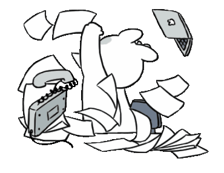

## ***hi, i'm arie***
i'm an aspiring EECS student... my friends and i build projects for local hackathons + community service

#### 💬 Languages & Technologies
` Python ` ` JavaScript ` ` ReactJS ` ` Java ` ` C++ ` ` HTML ` ` CSS ` `Swift`


 ### ~~~~~~~~~~~~~~~ Routine ~~~~~~~~~~~

<!--START_SECTION:waka-->


```text
Morning                  422 commits         ███████████░░░░░░░░░░░░░░ 45.23 % 
Daytime                  200 commits         █████░░░░░░░░░░░░░░░░░░░░ 21.44 % 
Evening                  95 commits          ███░░░░░░░░░░░░░░░░░░░░░░ 10.18 % 
Night                    216 commits         ██████░░░░░░░░░░░░░░░░░░░ 23.15 % 
```
```text
Monday                   111 commits         ███░░░░░░░░░░░░░░░░░░░░░░ 11.90 % 
Tuesday                  115 commits         ███░░░░░░░░░░░░░░░░░░░░░░ 12.33 % 
Wednesday                126 commits         ███░░░░░░░░░░░░░░░░░░░░░░ 13.50 % 
Thursday                 166 commits         ████░░░░░░░░░░░░░░░░░░░░░ 17.79 % 
Friday                   166 commits         ████░░░░░░░░░░░░░░░░░░░░░ 17.79 % 
Saturday                 183 commits         █████░░░░░░░░░░░░░░░░░░░░ 19.61 % 
Sunday                   66 commits          ██░░░░░░░░░░░░░░░░░░░░░░░ 07.07 % 
```


 Last Updated on 05/09/2026 20:34:35 UTC
<!--END_SECTION:waka-->

<div align="center">
  
</div>
