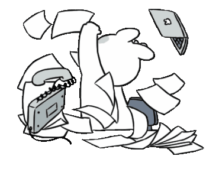

## ***hi, i'm arie***
i'm an aspiring EECS student... my friends and i build projects for local hackathons + community service

#### 💬 Languages & Technologies
` Python ` ` JavaScript ` ` ReactJS ` ` Java ` ` C++ ` ` HTML ` ` CSS ` `Swift`


 ### ~~~~~~~~~~~~~~~ Routine ~~~~~~~~~~~

<!--START_SECTION:waka-->


```text
Morning                  443 commits         ███████████░░░░░░░░░░░░░░ 45.67 % 
Daytime                  200 commits         █████░░░░░░░░░░░░░░░░░░░░ 20.62 % 
Evening                  101 commits         ███░░░░░░░░░░░░░░░░░░░░░░ 10.41 % 
Night                    226 commits         ██████░░░░░░░░░░░░░░░░░░░ 23.30 % 
```
```text
Monday                   111 commits         ███░░░░░░░░░░░░░░░░░░░░░░ 11.44 % 
Tuesday                  118 commits         ███░░░░░░░░░░░░░░░░░░░░░░ 12.16 % 
Wednesday                131 commits         ███░░░░░░░░░░░░░░░░░░░░░░ 13.51 % 
Thursday                 169 commits         ████░░░░░░░░░░░░░░░░░░░░░ 17.42 % 
Friday                   167 commits         ████░░░░░░░░░░░░░░░░░░░░░ 17.22 % 
Saturday                 191 commits         █████░░░░░░░░░░░░░░░░░░░░ 19.69 % 
Sunday                   83 commits          ██░░░░░░░░░░░░░░░░░░░░░░░ 08.56 % 
```


 Last Updated on 08/10/2026 23:30:18 UTC
<!--END_SECTION:waka-->

<div align="center">
  
</div>
